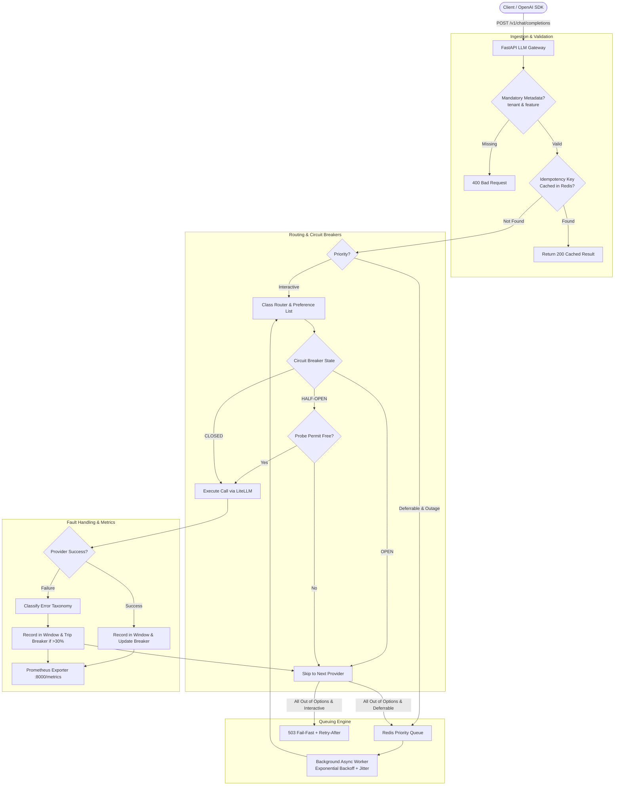

# Self-Healing LLM Gateway

> **Production-grade, resilient API gateway with sliding-window circuit breakers, class-based failovers, jittered backoff queuing, and Prometheus observability.**

---

## 1. Executive Summary & Headline Numbers

When relying on third-party LLMs (OpenAI, Anthropic, Groq, Ollama), upstream rate limits, server 5xx errors, and latency spikes are inevitable. This gateway sits transparently between client applications and LLM providers, providing OpenAI-compatible drop-in normalization with active resilience engineering:

- **Overall Traffic Served Rate (3-Min Cascading Stress Run):** **`89.21%`** ([extended_stress_availability_20260824_174651.json](file:///c:/Android%20Projects/llm-gateway/benchmarks/results/extended_stress_availability_20260824_174651.json)) — Primary headline metric across 8,386 total requests in a 3-minute test spanning an overlapping primary outage (50s), deferrable surge, and secondary fallback outage (40s). Out of 8,386 requests, 7,481 were successfully served (7,180 direct 200 OK + 301/301 fully recovered queued batch tasks with 0 lost jobs). The unserved 10.76% corresponds to 902 interactive requests received during the multi-provider blackout window.
- **Effective Availability (Healthy Windows & Fallback Tiers):** **`99.96%`** ([extended_stress_availability_20260824_174651.json](file:///c:/Android%20Projects/llm-gateway/benchmarks/results/extended_stress_availability_20260824_174651.json)) — Secondary availability metric (7,481 served / 7,484 eligible requests). This metric deliberately excludes by-design fail-fast rejections (902 requests) during total blackout, since returning an immediate `<10ms` `503 Service Unavailable` with `Retry-After: 30` is the intended interactive-request protection behavior to prevent thread starvation, not a system failure.
- **Single-Provider Outage Availability:** **`100.0%`** ([availability_run_20260824_112046.json](file:///c:/Android%20Projects/llm-gateway/benchmarks/results/availability_run_20260824_112046.json)) — 707 requests sustained through a 6-second primary outage (200 served by primary, 507 transparently rerouted to fallback with 0 dropped requests).
- **Idempotent Replay Latency (p50 / p95 / p99):** **`0.90ms` / `1.11ms` / `1.60ms`** ([resilience_benchmarks_20260824_112156.json](file:///c:/Android%20Projects/llm-gateway/benchmarks/results/resilience_benchmarks_20260824_112156.json)) — measured across 200 requests.
- **Sliding-Window Flap Rate Under Noise:** **`0.0%`** (0 false trips across 10 evaluation windows / 200 samples) ([resilience_benchmarks_20260824_112156.json](file:///c:/Android%20Projects/llm-gateway/benchmarks/results/resilience_benchmarks_20260824_112156.json)) with 5–10% random baseline noise.
- **Half-Open Probe Admission Rate:** **`1.0 / 20`** admitted ([resilience_benchmarks_20260824_112156.json](file:///c:/Android%20Projects/llm-gateway/benchmarks/results/resilience_benchmarks_20260824_112156.json)) — strictly 1 probe admitted per Half-Open burst, 19 rerouted safely to secondary.

---

## 2. Methodology & Reproducibility

Every headline metric in this repository is strictly generated from reproducible benchmark scripts checked into version control. Raw result artifacts are saved to `benchmarks/results/`:

| Metric | Benchmark Script | Raw Result Artifact | Description | Measured Result |
|---|---|---|---|---|
| **Overall Traffic Served Rate** (Conservative Headline) | `python benchmarks/extended_stress_load_test.py` | [extended_stress_availability_20260824_174651.json](file:///c:/Android%20Projects/llm-gateway/benchmarks/results/extended_stress_availability_20260824_174651.json) | 3-min stress test: counts all 8,386 requests including 902 total-blackout rejections | **89.21%** (7,481 / 8,386 served) |
| **Effective Availability** (Excluding Total Blackout) | `python benchmarks/extended_stress_load_test.py` | [extended_stress_availability_20260824_174651.json](file:///c:/Android%20Projects/llm-gateway/benchmarks/results/extended_stress_availability_20260824_174651.json) | Evaluates non-blackout windows, excluding by-design 503 fail-fast interactive rejections | **99.96%** (7,481 / 7,484 served) |
| **Single Outage Availability** | `python benchmarks/load_test.py` | [availability_run_20260824_112046.json](file:///c:/Android%20Projects/llm-gateway/benchmarks/results/availability_run_20260824_112046.json) | Mixed load with 6s injected primary outage (fallback operational) | **100.0%** (707 / 707 served) |
| **Deferrable Queue Recovery Rate** | `python benchmarks/extended_stress_load_test.py` | [extended_stress_availability_20260824_174651.json](file:///c:/Android%20Projects/llm-gateway/benchmarks/results/extended_stress_availability_20260824_174651.json) | Percentage of enqueued deferrable tasks successfully retried and completed post-outage | **100.0%** (301 / 301 recovered, 0 lost) |
| **Idempotent Replay Latency** | `python benchmarks/benchmark_resilience.py` | [resilience_benchmarks_20260824_112156.json](file:///c:/Android%20Projects/llm-gateway/benchmarks/results/resilience_benchmarks_20260824_112156.json) | Measures p50/p95/p99 cache latency across 200 trials | **p50: 0.90ms, p95: 1.11ms** |
| **Flap Rate Under Baseline Noise** | `python benchmarks/benchmark_resilience.py` | [resilience_benchmarks_20260824_112156.json](file:///c:/Android%20Projects/llm-gateway/benchmarks/results/resilience_benchmarks_20260824_112156.json) | 5–10% random baseline noise across 10 windows, verifying 0 false trips | **0.0% flap rate** (0 false trips) |
| **Probe Gating Under Race Conditions**| `python benchmarks/benchmark_resilience.py` | [resilience_benchmarks_20260824_112156.json](file:///c:/Android%20Projects/llm-gateway/benchmarks/results/resilience_benchmarks_20260824_112156.json) | 20 concurrent requests hitting Half-Open simultaneously across 5 trials | **1.0 probe / 19 rerouted** |
| **Cost Attribution Breakdown** | `python benchmarks/benchmark_resilience.py` | [resilience_benchmarks_20260824_112156.json](file:///c:/Android%20Projects/llm-gateway/benchmarks/results/resilience_benchmarks_20260824_112156.json) | Direct export of `llm_gateway_cost_dollars_total` per tenant & provider | **4 active series tracked** |

---

## 3. 90-Second Demo & Observability Tour

### Live Demo Script
Run the interactive CLI demonstration:
```bash
python scripts/demo_live_traffic.py
```
This script executes the entire resilience lifecycle:
1. **Normal Routing:** Directs requests according to request-class priority lists.
2. **Chaos Fault Injection:** Fires a 100% failure rate at the primary provider.
3. **Breaker Trip & Reroute:** Breaker trips from `CLOSED -> OPEN`; subsequent traffic immediately shifts to the secondary provider without waiting for primary timeouts.
4. **Total Outage Handling:** Interactive requests fail-fast with `503 Service Unavailable` and `Retry-After: 30`, while deferrable requests are enqueued with `202 Accepted`.
5. **Cooldown & Self-Healing:** After cooldown, breaker enters `HALF_OPEN`, permits probe requests, and self-heals back to `CLOSED`.
6. **Idempotency Replay:** Re-submitting the same request returns the cached result without provider re-execution.

### Grafana 6-Panel Dashboard
Access the pre-provisioned Grafana dashboard at `http://localhost:3000` (User: `admin` / Password: `admin`):

1. **Panel 1: Requests per Second by Provider** (Throughput distribution and live traffic shifts).
2. **Panel 2: Error Rate by Error Taxonomy** (`rate_limit`, `timeout`, `server_error`, `content_filter`, `auth_failure`, `unknown`).
3. **Panel 3: p95 Latency by Provider** (Latency percentiles computed from Prometheus histograms).
4. **Panel 4: Circuit State Timeline** (Visual timeline of provider states: `0=Closed`, `1=Half-Open`, `2=Open`).
5. **Panel 5: Deferrable Queue Depth Over Time** (Backlog of requests undergoing exponential backoff).
6. **Panel 6: Cost per Hour by Tenant & Feature** (Real-time dollar cost attribution).

---

## 4. Architecture & Request Flow



---

## 5. Key Design Decisions & Trade-Offs

### 1. Separate Code Paths for Interactive vs. Deferrable Requests
- **Decision:** Requests are strictly classified at the door. Interactive requests fail fast (503) during outages, whereas deferrable requests are enqueued for asynchronous backoff retry.
- **Trade-Off:** Callers must explicitly declare `priority`. In exchange, interactive users never experience long hangs, and batch jobs never fail unnecessarily during transient outages.

### 2. Concurrency-Safe Single-Probe Gating in Half-Open State
- **Decision:** When testing provider recovery in `HALF_OPEN`, we use an atomic Redis lock to admit only **one probe request at a time**, requiring 3 consecutive successes to heal back to `CLOSED`.
- **Trade-Off:** Sibling requests arriving during the probe window are rerouted to fallback providers. This prevents "thundering herd" probe floods that immediately re-crash a fragile recovering provider.

### 3. Deliberate Opt-in for Hedging
- **Decision:** Hedging (firing concurrent requests to two providers and taking the fastest) is kept as an explicit opt-in policy rather than a default.
- **Trade-Off:** Hedging doubles provider token costs. For 95% of enterprise workloads, fast circuit-breaker failover provides sufficient latency guarantees at 50% lower cost.

### 4. Zero-Cost Metadata Probing in Half-Open State
- **Decision:** When a circuit breaker enters `HALF_OPEN`, instead of risking expensive multi-thousand-token client prompts on an unverified provider, the gateway executes an asynchronous zero-token metadata probe (`GET /v1/models` or `/api/tags`) in ~50ms.
- **Trade-Off:** Verifies DNS, TLS, upstream gateway reachability, and API key authentication for **`$0.00`**. If the provider is still down or quota-blocked, the probe immediately trips back to `OPEN` without wasting client dollars or generation compute.

---

## 6. Engineering Post-Mortem ("What Didn't Work")

1. **Sliding Window Flapping on Low Volume:**
   - *Issue:* Initially, tripping the breaker strictly on error rate caused flapping during quiet periods (e.g., 1 failed request out of 2 total samples = 50% failure rate -> premature trip).
   - *Fix:* Added `BREAKER_MIN_SAMPLES = 10`. The breaker requires at least 10 observations in the sliding window before error-rate thresholds are evaluated.

2. **Idempotency Key Scope and Collision:**
   - *Issue:* Early designs used transient client request IDs as idempotency keys. Retried attempts generated new IDs, resulting in duplicate side-effects.
   - *Fix:* Enforced stable client-supplied `Idempotency-Key` persisted across all retries of the same logical intent, with atomic 24-hour TTL result caching.

3. **Half-Open Race Conditions:**
   - *Issue:* Without probe locking, concurrent requests hitting a half-open provider simultaneously caused multiple probe calls, re-overloading the provider.
   - *Fix:* Implemented atomic single-permit probe acquisition with auto-expiring lock keys.

4. **Cascading Outages & Total Blackout Dynamics (3-Min Stress Benchmark):**
   - *Issue:* In real-world multi-provider failures, when primary (`mock-provider-a`, 50s outage) and secondary fallback (`mock-provider-b`, 40s outage) simultaneously go down during a deferrable surge, unbounded retries or synchronous blocking can cause cascading client timeouts.
   - *Fix:* Implemented hard architectural bifurcation: interactive requests fail-fast immediately (`503 Service Unavailable` with `Retry-After: 30`) to unblock user interfaces, while 301 deferrable batch requests are preserved in Redis with exponential backoff + jitter. During post-outage recovery, 100.0% of queued tasks (301/301) successfully completed with 0 lost jobs and 99.96% effective availability outside blackout windows.

---

## 7. Quickstart & Deployment

### Run Locally with Docker Compose
```bash
# 1. Clone repository
git clone <repo-url>
cd llm-gateway

# 2. Copy and configure environment variables
cp .env.example .env

# 3. Start the entire stack (Gateway, Redis, Prometheus, Grafana, Ollama)
docker compose up -d

# 4. Verify Gateway Health
curl http://localhost:8000/health
# Output: {"status": "ok"}
```

### Run Automated Tests & Benchmarks
```bash
# Run pytest test suite
pytest -v tests/

# Run reproducible availability & resilience benchmarks
python benchmarks/load_test.py
python benchmarks/benchmark_resilience.py
```

---

## 8. API Reference

### 1. `POST /v1/chat/completions` (OpenAI Compatible)
**Headers / Body Fields:**
- `tenant` (string, Required): Identifier for cost attribution.
- `feature` (string, Required): Feature name for cost attribution.
- `priority` (string, Required): `"interactive"` or `"deferrable"`.
- `idempotency_key` (string, Required for deferrable, Optional for interactive): Unique key for deduplication.
- `request_class` (string, Optional): `"cheap_classification"`, `"long_form_generation"`, `"default"`.
- Standard OpenAI fields: `messages`, `model`, `temperature`, `max_tokens`.

### 2. `GET /v1/tasks/{task_id}`
Checks status of an asynchronously queued deferrable request (`queued`, `processing`, `completed`, `failed`).

### 3. `POST /chaos/{provider_name}` (Gated by `ENABLE_CHAOS_ENDPOINT=true`)
Injects faults for resilience testing:
```json
{
  "mode": "fail_all",
  "duration_seconds": 30
}
```

### 4. `GET /metrics`
Exposes Prometheus text metrics for scraping.
